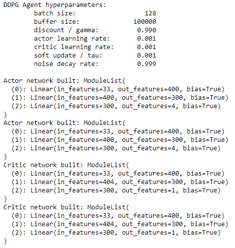
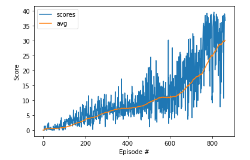

# Project report
This is the report for the Continuous Control problem.

## Learning algorithm
The learning algorithm used to solve this problem is DDPG (Deep Deterministic Policy Gradient).

### Some quick facts about DDP:
- off-policy algorithm.
- can only be used for environments with continuous action spaces.
- can be thought of as being deep Q-learning for continuous action spaces.

The agent network architecture is as follows:
There are two networks (One for actor and one for critic),The Actor Network has an input of 33 variables which represent the observation space, it generates an output of 
4 numbers which represent the best action predicted for that observed state. 

As fot the Critic Network, it receives as input 33 variables which also represent the observation space. it generates an output of 1 number.

The output of the critic is the target value prediction based on the given state and the estimated best action.

### Taining parameters used:
- buffer size: 10^5
- batch size: 128
- lr actor: 10^-3 (coefficient that scale delta before it is applied to the parameters - for actor)
- lr critic: 10^-3 (coefficient that scale delta before it is applied to the parameters -for critic) 
- gamma: 0.99
- tau: 10^-3
- noise decay: 0.999

- fully connected layers for the actor network: (layer1: 400 nodes, layer 2: 300 nodes)
- fully connected layers for the critic network: (layer1: 400 nodes, layer 2: 300 nodes)
- max time: 1,000
- target score: 30.0
- target episodes: 100

## Results:
The algorithm was able to solve the problem in 761 episodes

## Future work and Improvments
- I would like to try different architectures for both actor and critic networks
- Using multiple agents will open up other AC techniques like A3C or A2C 
- Compare results with PPO
- Further tuning of hyperparameters
